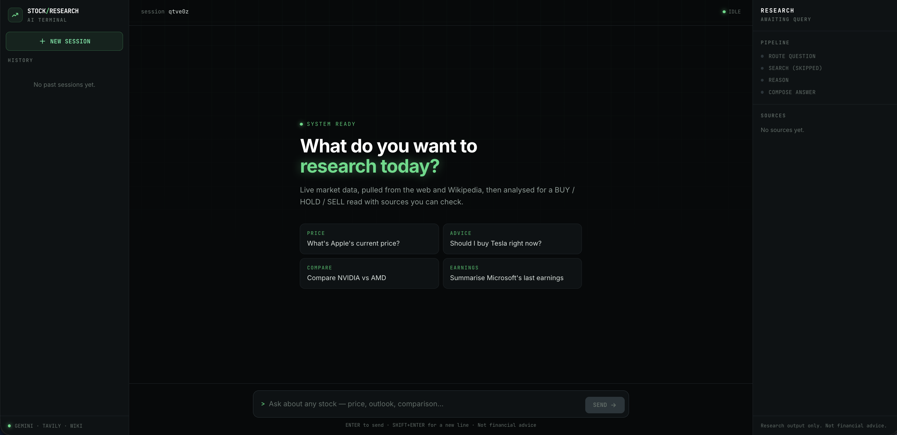

# Stock Research AI

An AI stock research terminal. Ask about any stock and it decides whether it needs live data,
pulls it from the web and Wikipedia, then returns a structured analysis with a BUY / HOLD / SELL
read — streamed token by token, with every source cited.



## Stack

**Backend** — FastAPI · LangGraph · Google Gemini · Tavily · SQLite
**Frontend** — React 19 · Vite 7 · Tailwind v4

## Run it

```bash
# 1. Backend
pip install -r requirements.txt
echo "GOOGLE_API_KEY=your_key_here" > .env
python fastapi_research.py          # → http://localhost:8000 (docs at /docs)

# 2. Frontend
cd frontend
npm install
npm run dev                         # → http://localhost:5173
```

Or `./start_app.sh` to launch both.

## How it works

```
question → route (search needed?) → fetch live data → reason → compose answer
                                         ↓
                              Tavily · Wikipedia · Gemini
```

Answers stream over SSE (`POST /analyze/stream`). Conversation memory is handled by LangGraph's
`MemorySaver`, keyed per session; messages and sources are persisted to SQLite so history
survives a restart.

## Interface

Three panes: **sessions** on the left, **conversation** in the middle, and a **research rail**
on the right holding the run pipeline, every cited source, and the model's reasoning trace —
so the transcript itself stays readable. The rail collapses below 1280px, the sidebar below
1024px.

## API

| Endpoint | Purpose |
| -------- | ------- |
| `POST /analyze/stream` | Ask a question, stream the answer (SSE) |
| `GET /sessions` | List chat sessions |
| `GET /sessions/{id}` | Messages for a session |
| `DELETE /sessions/{id}` | Delete a session |
| `GET /health` | Health check |

## Config

| Variable | Where | Default |
| -------- | ----- | ------- |
| `GOOGLE_API_KEY` | `.env` | required |
| `VITE_API_URL` | `frontend/.env` | `http://localhost:8000` |

---

Research output only. Not financial advice.
